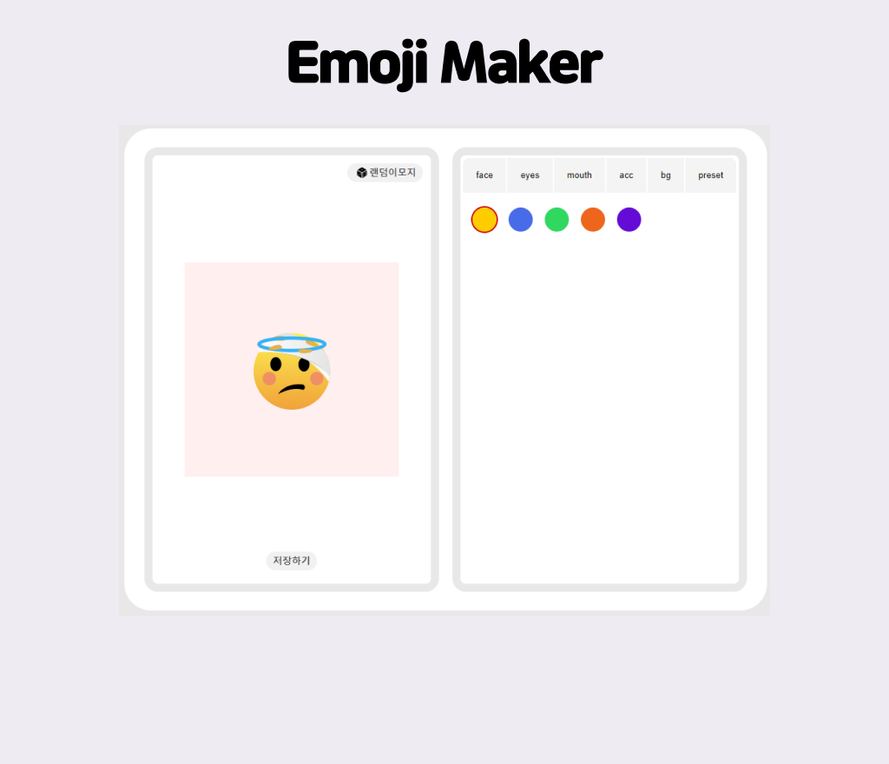

## Emoji Maker

### 프로젝트 소개

- 맘에 드는 에셋을 선택해 이모지를 만들 수 있게 했습니다
- 완성된 이모지를 스토어를 이용해 로컬스토리지에 저장할 수 있습니다.
- 로컬스토리지에 저장된 이미지를 프리셋 기능으로 불러올 수 있습니다.

### 프로젝트 설명

- 작업기간: 2024.05.17 - 2024.05.24
- 사용 언어: Vue.js, css 사용

